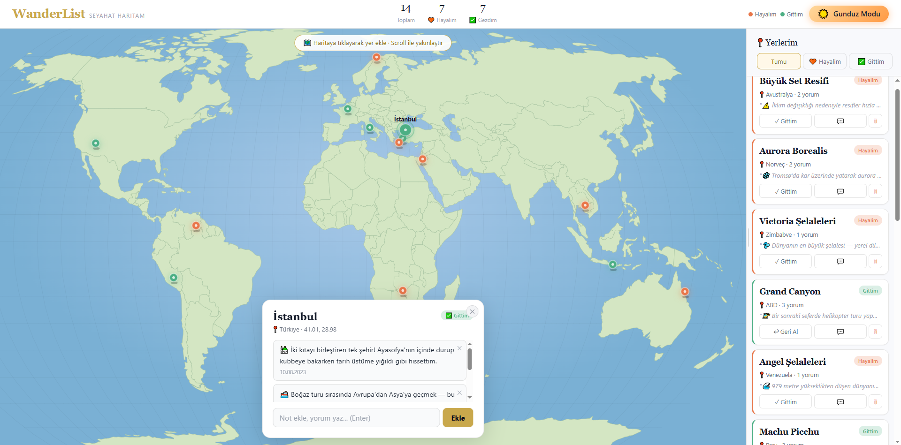
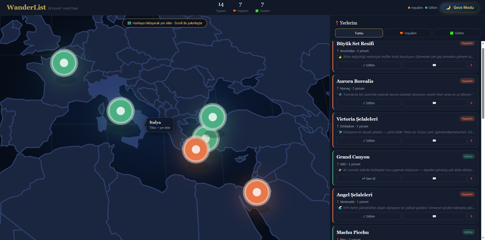
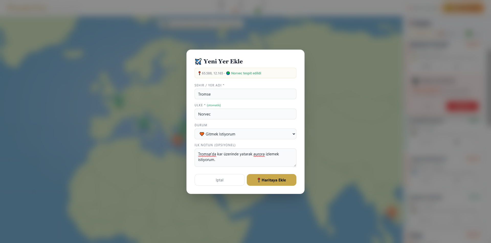
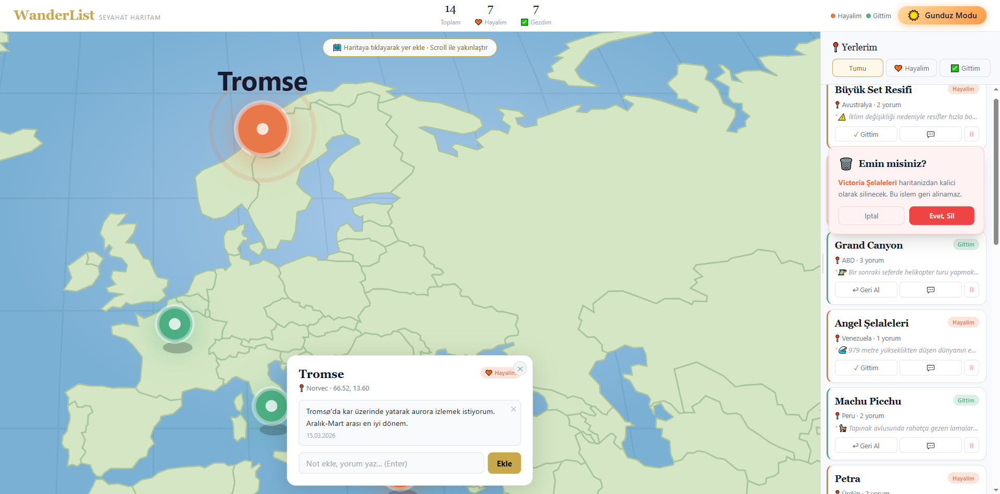

# 🌍 WanderList – Interactive Travel Map

WanderList is an interactive travel tracking web application built with **React, TailwindCSS and D3.js**.
Users can mark places on a world map, track places they want to visit, record places they have visited and leave personal notes.

This project was developed as part of a **JavaScript Web Development training program** to practice frontend development concepts.

---

# ✨ Features

* 🌍 Interactive **World Map (D3.js)**
* 📍 Add places by clicking on the map
* 🧡 Mark places as **"Wish to Visit"**
* ✅ Mark places as **"Visited"**
* 💬 Add and delete **comments**
* 🗑 Delete places
* 🔎 Filter places (All / Wish / Visited)
* 📊 Travel statistics
* 🌙 Dark / Light Mode
* 📌 Animated location pins
* 💡 Country tooltip detection

---

# 🖥️ Project Screenshot




---

# 🛠️ Technologies Used

* **React.js**
* **Tailwind CSS**
* **D3.js**
* **TopoJSON**
* **JavaScript (ES6+)**
* **HTML5 / CSS3**

---

# 📂 Project Structure

```
src
 ├── components
 │    ├── Header.jsx
 │    ├── WorldMap.jsx
 │    ├── Sidebar.jsx
 │    ├── PlaceCard.jsx
 │    ├── DetailPanel.jsx
 │    └── AddModal.jsx
 │
 ├── pages
 │    └── Home.jsx
 │
 ├── data
 │    ├── countries.js
 │    └── samplePlaces.js
 │
 ├── App.js
 └── index.js
```

---

# ⚙️ Installation

Clone the repository:

```bash
git clone https://github.com/YOURUSERNAME/wanderlist.git
```

Install dependencies:

```bash
npm install
```

Run the development server:

```bash
npm start
```


# 🎯 Learning Objectives

This project helped practice:

* React component architecture
* State management with React Hooks (useState, useEffect, useRef, useCallback)
* Interactive data visualization with D3.js
* TailwindCSS styling
* CRUD operations
* User interaction design
  
# 🚀 Live Demo

https://wanderlist.netlify.app

